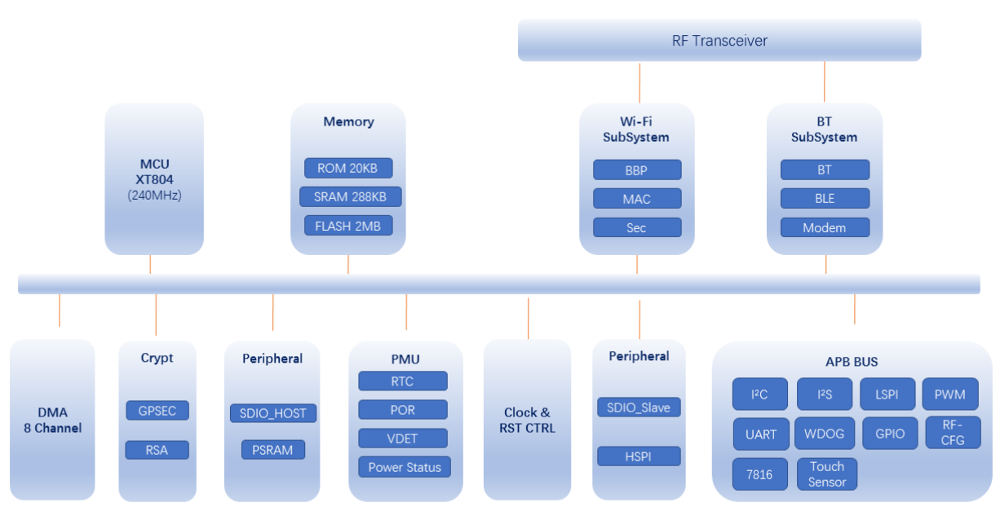

# [W800](https://github.com/SoCXin/W800)

* [winnermicro](http://www.winnermicro.com/): XT804
* [L5R4](https://github.com/SoCXin/Level): 240 MHz

## [简介](https://github.com/SoCXin/W800/wiki)

[W800](https://github.com/SoCXin/W800) 是一款安全 IoT Wi-Fi/蓝牙 双模 SoC 芯片。支持 2.4G IEEE802.11b/g/n Wi-Fi 通讯协议；支持 BT/BLE 双模工作模式，支持 BT/BLE4.2 协议。芯片集成 32 位 CPU 处理器，内置 UART、GPIO、SPI、I2C、I2S、7816 等数字接口；支持TEE安全引擎，支持多种硬件加解密算法，内置 DSP、浮点运算单元，支持代码安全权限设置，内置 2MBFlash 存储器，支持固件加密存储、固件签名、安全调试、安全升级等多项安全措施，保证产品安全特性。适用于用于智能家电、智能家居、智能玩具、无线音视频、工业控制、医疗监护等广泛的物联网领域。

### 关键特性

* Wi-Fi
* BT/BLE4.2
* 集成 32 位 XT804 处理器，工作频率 240MHz，内置 DSP、浮点运算单元与安全引擎
* 内置 2MB Flash，288KB RAM
* 集成 5 路 UART 高速接口
* 集成 2 路 16 比特 SD-ADC，最高采样率 1KHz
* 内置 Tee 安全引擎
* 1 路 Duplex I2S 控制器

#### 相对短板

* IO资源

采用XT804内核相对Cortex在开发方式需要切换，生态需要改变，同时W800定位SoC通信产品，封装规格较小，IO资源少

### [资源收录](https://github.com/SoCXin)

* [参考资源](src/)
* [参考文档](docs/)
* [参考工程](project/)
* [入门教程](https://docs.soc.xin/W800)

### [选型建议](https://github.com/SoCXin)

[W800](https://github.com/SoCXin/W800)

#### 封装规格

* QFN32(4x4mm)

### [探索芯世界 www.SoC.xin](http://www.SoC.Xin)
